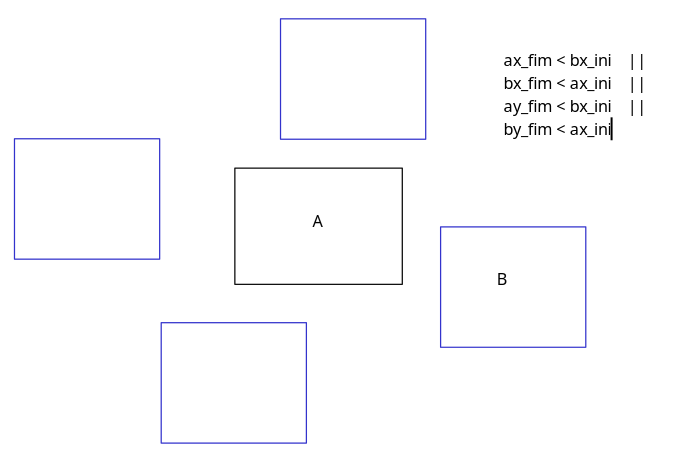

# Pratica - Círculos e Pontos Colidindo

<!-- toc -->
- [Parte 1 - Está contido](#parte-1---está-contido)
  - [Draft1](#draft1)
  - [Resultado1](#resultado1)
- [Parte 2 - Está colidindo com outro retângulo](#parte-2---está-colidindo-com-outro-retângulo)
  - [Draft2](#draft2)
  - [Resultado2](#resultado2)
- [Parte 3 - Colisão entre múltiplos retângulos](#parte-3---colisão-entre-múltiplos-retângulos)
  - [Draft3](#draft3)
<!-- toc -->

- Pegue o Retângulo que você criou na atividade [Pontos e Círculos](vector2d_pratica.md)

## Parte 1 - Está contido

Faça o método `contains` da classe `Rect` recebe um ponto e retorna `true` se o ponto estiver dentro do retângulo e `false` caso contrário.

Depois, utilize esse sketch para testar o método:

### Draft1

```ts
class Vector2d {
    x: number;
    y: number;

    constructor(x: number, y: number) {
        this.x = x;
        this.y = y;
    }

    dist(other: Vector2d): number {
        return dist(this.x, this.y, other.x, other.y);
    }

    toString(): string {
        return `${this.x}:${this.y}`
    }
}

class Rect {
    pos: Vector2d;
    size: Vector2d;

    constructor(x: number, y: number, w: number, h: number) {
        this.pos = new Vector2d(x, y);
        this.size = new Vector2d(w, h);
    }

    draw(): void {
        rect(this.pos.x, this.pos.y, this.size.x, this.size.y);
    }

    contains(pos: Vector2d): boolean {
        //Faça seu código aqui
    }
}

function setup() {
    createCanvas(600, 300);
}

let rect1 = new Rect(100, 100, 230, 170);

function draw() {
    background(100);
    let mouse = new Vector2d(mouseX, mouseY);
    if (rect1.contains(mouse)) {
        fill(255, 0, 0);
    } else {
        fill(0, 255, 0);
    }
    rect1.draw();
}
```

### Resultado1

[link](https://user-images.githubusercontent.com/4747652/273888957-eef111c4-b920-4f99-824f-dc389d713848.mp4)

## Parte 2 - Está colidindo com outro retângulo



[link](https://user-images.githubusercontent.com/4747652/273901159-d80ee59e-9860-425a-8aaf-a7532e87d59b.mp4)

### Draft2

```ts
class Vector2d {
    x: number;
    y: number;

    constructor(x: number, y: number) {
        this.x = x;
        this.y = y;
    }

    dist(other: Vector2d): number {
        return dist(this.x, this.y, other.x, other.y);
    }

    toString(): string {
        return `${this.x}:${this.y}`
    }
}

class Rect {
    pos: Vector2d;
    size: Vector2d;

    constructor(x: number, y: number, w: number, h: number) {
        this.pos = new Vector2d(x, y);
        this.size = new Vector2d(w, h);
    }

    draw(): void {
        rect(this.pos.x, this.pos.y, this.size.x, this.size.y);
    }

    contains(pos: Vector2d): boolean {
        //Faça seu código aqui
    }

    isColliding(other: Rect): boolean {
        //Faça seu código aqui
    }
}

function setup() {
    createCanvas(600, 300);
    rectMode(CENTER);
}

let rect1 = new Rect(200, 100, 120, 100);
let size = 150;

function draw() {
    background(100);
    let rect2 = new Rect(mouseX, mouseY, size, size);

    if (rect1.isColliding(rect2)) {
        fill(255, 0, 0);
    } else {
        fill(0, 255, 0);
    }
    text("use scroll to increase or decrease size", 10, 10);
    rect1.draw();
    rect2.draw();
}

//scroll to increase ou decrease size
function mouseWheel(event: WheelEvent) {
    size += event.deltaY / 10;
}

```

### Resultado2

[link](https://user-images.githubusercontent.com/4747652/273901808-336c1097-2183-466d-9b21-1dc4fa979e57.mp4)

## Parte 3 - Colisão entre múltiplos retângulos

[link](https://user-images.githubusercontent.com/4747652/273925252-44225ceb-f9dc-47fa-b0ce-0e71c5a37cd6.mp4)

### Draft3

```ts
class Vector2d {
    x: number;
    y: number;

    constructor(x: number, y: number) {
        this.x = x;
        this.y = y;
    }

    dist(other: Vector2d): number {
        return dist(this.x, this.y, other.x, other.y);
    }

    toString(): string {
        return `${this.x}:${this.y}`
    }
}

class Rect {
    pos: Vector2d;
    size: Vector2d;

    constructor(x: number, y: number, w: number, h: number) {
        this.pos = new Vector2d(x, y);
        this.size = new Vector2d(w, h);
    }

    draw(): void {
        rect(this.pos.x, this.pos.y, this.size.x, this.size.y);
    }

    contains(pos: Vector2d): boolean {
        //Faça seu código aqui
    }

    isColliding(other: Rect): boolean {
        //Faça seu código aqui
    }

    isCollidingList(list: Rect[]): boolean {
        //Faça seu código aqui
    }
    clone(): Rect {
        //Faça seu código aqui
    }
    increase(): void {
        //Faça seu código aqui
    }
    decrease(): void {
        //Faça seu código aqui
    }
}

let elementos: Rect[] = [];

function setup() {
    createCanvas(900, 700);
    noFill();
    frameRate(10);
    for (let i = 0; i < 100; i++) {
        elementos.push(new Rect(random(0, width), random(0, height), random(50), random(50)));
    }
}

function draw() {
    background(100);
    for (let elem of elementos) {
        if (elem.isCollidingList(elementos)) {
            elem.decrease();
        } else {
            elem.increase();
        }
    }
    for (let elem of elementos) {
        elem.draw();
    }
}

```
